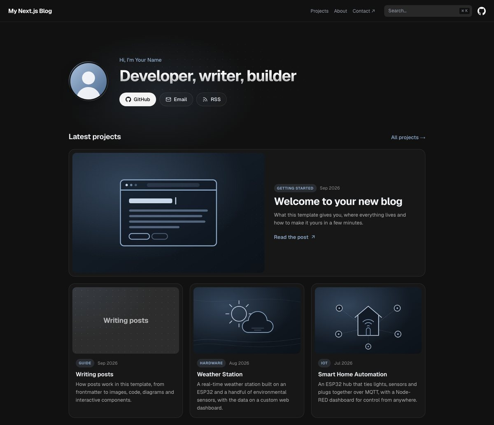

# Next.js Blog Template

A fast, clean blog you can make your own in a few minutes. Write posts in MDX, edit one config file, and deploy for free on Vercel.

Built with **Next.js 16** (App Router) and **Nextra 4**. It started as the base for [t0nyz.com](https://t0nyz.com).



[](https://vercel.com/new/clone?repository-url=https%3A%2F%2Fgithub.com%2Ft0nyz0%2Fnextjs-blog&project-name=nextjs-blog&repository-name=nextjs-blog)

## Features

- **A homepage that builds itself.** Hero, featured post, post cards, a goals checklist and a call to action. Your name, tagline, photo and links come from `site.config.ts`.
- **Posts in MDX.** Markdown plus React components when you need them. Frontmatter sets the date, tag and cover image.
- **Newest first, everywhere.** Posts are sorted by date on the homepage, the projects page, the sidebar and the RSS feed. No list to maintain.
- **Reading time and dates** under every post title.
- **Search built in.** [Pagefind](https://pagefind.app) indexes the site at build time. No service to sign up for.
- **Dark mode**, a table of contents, syntax highlighting with copy buttons, Mermaid diagrams, GitHub-style callouts and image zoom.
- **SEO handled.** Titles, descriptions, canonical URLs, Open Graph and Twitter cards, `sitemap.xml`, `robots.txt` and an RSS feed at `/feed.xml`.
- **Fast by default.** Every page is static HTML. Images are optimized with `next/image` and the Geist font is self-hosted with `next/font`.
- **Optional Google Analytics 4.** Add your measurement ID to `site.config.ts`.

## Getting started

### Deploy it

Click **Deploy with Vercel** above. Vercel copies the repo to your GitHub account and deploys it. Every push to `main` after that goes live automatically.

### Run it locally

Use Node.js 22.12+ or 24.x.

```sh
git clone https://github.com/t0nyz0/nextjs-blog.git
cd nextjs-blog
npm install
npm run dev
```

Open [http://localhost:3000](http://localhost:3000). Pages reload as you edit. Search needs the index that a production build generates, so try it with `npm run build && npm start`.

## Make it yours

1. **`site.config.ts`**: your site title, name, tagline, links, repo, accent color and (optionally) Google Analytics ID.
2. **`public/images/avatar.svg`**: replace it with a photo of yourself and point `avatar` in `site.config.ts` at it. Swap the favicons in `public/` too.
3. **`content/index.mdx`**: the homepage. Rearrange the sections, change the goals, or edit the call to action.
4. **`content/about.mdx`**: your About page.
5. **`content/projects/`**: delete the sample posts and write your own.
6. **`NEXT_PUBLIC_SITE_URL`**: once you have a custom domain, set this environment variable in Vercel (e.g. `https://example.com`) so canonical links, the sitemap and the RSS feed use it. Until then the Vercel production URL is used.

## Writing posts

Add an `.mdx` file to `content/projects`. The file name becomes the URL: `content/projects/my-first-post.mdx` is published at `/projects/my-first-post`.

```yaml
---
title: My first post
description: One or two sentences for the card, search engines and the RSS feed.
date: 2026-09-26
tag: Notes
image: /images/my-first-post/cover.jpg
---

# My first post

Write your post here.
```

| Field | What it does |
| --- | --- |
| `title` | Page title, browser tab, search results and cards |
| `description` | Card blurb, meta description and RSS summary |
| `date` | Publish date (`YYYY-MM-DD`). Sorts posts and shows under the title with the reading time |
| `updated` | Optional. Adds "Updated …" after the date |
| `tag` | Optional. The small label on cards |
| `image` | Optional. Card thumbnail and social share image. Use a JPG or PNG, ideally 16:10 |
| `draft: true` | Keeps a post off the homepage, the projects page and the RSS feed |
| `display: hidden` | Also hides it from the sidebar. The URL still works |
| `searchable: false` | Leaves the page out of site search |

Start each post with a `# Title` heading; the date and reading time appear right under it. Images go in `public/images` and are referenced from the site root (``). The sample post [Writing posts](content/projects/writing-posts.mdx) shows code blocks, callouts, diagrams and interactive components.

You can organize posts into subfolders (e.g. `content/projects/2026/`); they're still listed newest first.

## Project structure

```
app/
  [[...mdxPath]]/page.tsx   renders every MDX page, adds post dates and SEO tags
  layout.tsx                navbar, footer, search, fonts and theme
  feed.xml/route.ts         RSS feed
  sitemap.ts, robots.ts, manifest.ts, not-found.tsx
components/
  Home.tsx                  homepage building blocks (Hero, Section, ProjectGrid, CallToAction)
  PostMeta.tsx              "Sep 26, 2026 · 3 min read" under post titles
content/                    every page on the site, as MDX; _meta.ts files set navigation
lib/                        post listing and date helpers
public/                     images, favicons (served from the site root)
styles/globals.css          design tokens and a few global styles
site.config.ts              everything personal about the site
```

## Scripts

| Command | What it does |
| --- | --- |
| `npm run dev` | Local development server at http://localhost:3000 |
| `npm run build` | Production build, then builds the search index into `public/_pagefind` |
| `npm start` | Serves the production build |
| `npm run typecheck` | Generates route types and runs the TypeScript compiler |

## Updating dependencies

Both npm and pnpm lockfiles are maintained. After updating, refresh the pnpm lockfile from npm's and check both:

```sh
npm update
pnpm import
npm audit
pnpm audit
npm run build
npm run typecheck
```

For a clean pnpm checkout, use `pnpm install --frozen-lockfile`, then `pnpm build` and `pnpm typecheck`. Don't switch package managers inside an existing `node_modules`; verify each one in a separate clean checkout.

The `overrides` and `pnpm.overrides` sections in `package.json` must stay identical. They exist for two reasons:

- **`@xmldom/xmldom`**: forces a patched release under Nextra's math dependencies, which pin a vulnerable version. Remove it once `npm audit` passes without it.
- **`zod`**: pinned to 4.3.x because Nextra 4.6.1's layout validation fails with zod 4.4 and newer ("expected nonoptional, received undefined" while prerendering). Remove the pin once a Nextra release fixes it, and confirm `npm run build` still passes.

`next.config.mjs` also overrides Nextra's Turbopack alias for its Mermaid component. In Nextra 4.6.1 that alias doesn't resolve when pnpm installs packages under `node_modules/.pnpm` (Vercel uses pnpm when it finds `pnpm-lock.yaml`), which fails the build with "Can't resolve '@theguild/remark-mermaid/mermaid'". Remove the override once Nextra fixes it, and confirm a clean `pnpm install --frozen-lockfile && pnpm build` still passes.

After updating, check `/`, `/projects`, a post, `/about` and a missing page in the browser, in both light and dark mode, including search, the mobile menu, images and the Mermaid diagrams. Dependency audits check known advisories; they aren't a full security review of the site's code.

## License

[MIT](LICENSE). Icons are adapted from [Octicons](https://github.com/primer/octicons) (MIT) and drawn in the style of [Lucide](https://lucide.dev) (ISC). The sample cover illustrations are original to this template.
