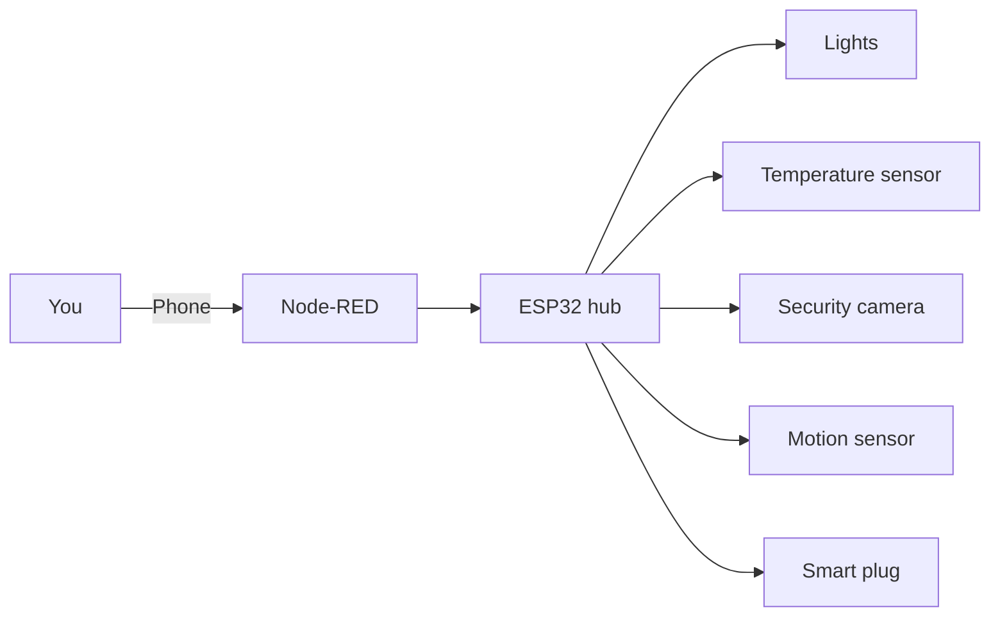

# Smart Home Automation

This project brings the connected devices around a house under one roof. An ESP32 acts as the hub, talking to lights, sensors and smart plugs over MQTT, and a Node-RED dashboard lets you watch and control everything from a phone.

The goal is convenience, a little extra security, and lower energy bills from routines that switch off what nobody is using.

## Features

- **Central hub**: one ESP32 coordinates every device.
- **Live monitoring**: temperature, humidity and motion readings as they happen.
- **Remote control**: lights, plugs and the camera from anywhere, through the dashboard.
- **Energy routines**: automations turn off idle devices and adjust the thermostat.
- **Easy to extend**: new devices only need to publish to an MQTT topic.

## How it fits together

