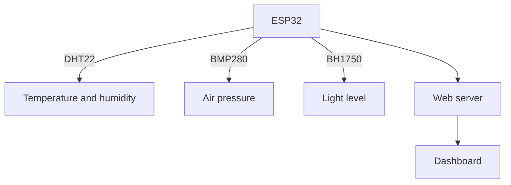

# Weather Station

This project monitors and logs temperature, humidity, air pressure and light levels. An ESP32 reads a few sensors and serves the readings on a small web dashboard, so you can check conditions from any browser on the network.

It works as a personal weather station, a learning project, or one piece of a larger home IoT setup.

## Features

- **Real-time readings**: sensor values refresh continuously on the dashboard.
- **Web dashboard**: a responsive page served straight from the ESP32.
- **Data logging**: readings are stored and charted over time.
- **Alerts**: configurable thresholds for extreme conditions.
- **Wi-Fi**: no cables beyond power.

## Components

- **ESP32**: reads the sensors and hosts the dashboard
- **DHT22**: temperature and humidity
- **BMP280**: barometric pressure
- **BH1750**: light level

## How it fits together

