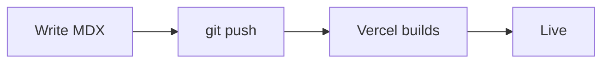

import { Steps } from 'nextra/components'
import { Counter } from '../../components/Counter'

# Writing posts

Every post is an MDX file in `content/projects`. The file name becomes the address, so `content/projects/my-first-post.mdx` is published at `/projects/my-first-post`. New posts show up on the homepage, the projects page, the sidebar and the RSS feed on their own, newest first.

## Frontmatter

Each post starts with a short block of settings:

```yaml filename="content/projects/my-first-post.mdx"
---
title: My first post
description: One or two sentences for the card, search engines and the RSS feed.
date: 2026-09-26
tag: Notes
image: /images/my-first-post/cover.jpg
---
```

| Field | What it does |
| --- | --- |
| `title` | The page title, used in the browser tab, search results and cards |
| `description` | The blurb on cards, the meta description and the RSS summary |
| `date` | Publish date as `YYYY-MM-DD`. Sorts posts and shows under the title with the reading time |
| `updated` | Optional. Adds "Updated …" after the date |
| `tag` | Optional. The small label on cards |
| `image` | Optional. The card thumbnail and the image for social shares. Use a JPG or PNG, ideally 16:10 |
| `draft: true` | Keeps a post off the homepage, the projects page and the RSS feed |
| `display: hidden` | Also hides it from the sidebar. The address still works for anyone with the link |
| `searchable: false` | Leaves the page out of site search |

Posts without an `image` get a card with their title instead, like this one.

## Images

Put images in `public/images` and reference them from the site root. Local images are sized automatically, load with a blurred preview, and zoom when clicked:

```md

```

## Code

Code blocks get syntax highlighting and a copy button. Add a `filename` to label them:

```ts filename="lib/greet.ts"
export function greet(name: string) {
  return `Hello, ${name}!`;
}
```

## Callouts

GitHub-style alerts work out of the box. Keep the `[!TIP]` marker on its own line, followed by an empty `>` line:

> [!TIP]
>
> Run `npm run dev` while you write and the page refreshes every time you save.

## Diagrams

Fenced `mermaid` blocks turn into diagrams:



## Interactive components

MDX can import React components. This counter lives in `components/Counter.tsx`:

<Counter />

## Publishing

<Steps>

### Write

Add an `.mdx` file to `content/projects` with the frontmatter above.

### Preview

Run `npm run dev` and open [localhost:3000](http://localhost:3000). Search only works in a production build (`npm run build && npm start`), because the index is generated at the end of the build.

### Push

Commit and push. Vercel builds the site and your post is live a minute later.

</Steps>
